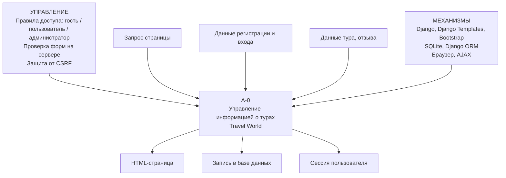
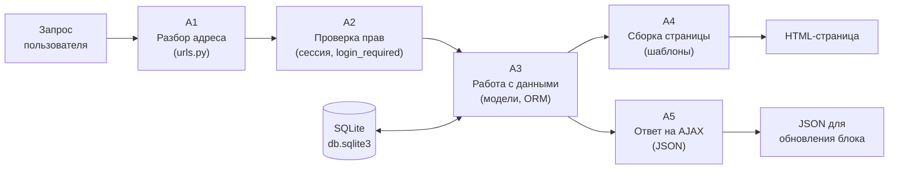

# IDEF0. Контекстная диаграмма A-0

Проект: веб-приложение «Бюро путешествий» (Travel World)
Траектория А: Django + Django Templates

---

## Диаграмма A-0

Система показана одним блоком «Управление информацией о турах».
Слева входы, сверху управление, справа выходы, снизу механизмы.

## Пояснение к дугам

| Тип | Что это |
|---|---|
| Вход | Запрос страницы, данные регистрации и входа, данные нового тура или отзыва |
| Управление | Правила разграничения доступа, валидация форм, защита от CSRF |
| Выход | Готовая HTML-страница, запись в базе, открытая сессия |
| Механизм | Django и его шаблонизатор, Bootstrap, SQLite через ORM, браузер |

---

## Декомпозиция A0

Основной блок разбит на пять функций.

| Блок | Что делает | Где в коде |
|---|---|---|
| A1 | Определяет, какая функция обслуживает адрес | `config/urls.py`, `tours/urls.py`, `users/urls.py` |
| A2 | Проверяет, вошёл ли пользователь и его ли это тур | `@login_required`, проверка автора в `views.py` |
| A3 | Читает и пишет данные через ORM | `tours/models.py`, `users/models.py` |
| A4 | Подставляет данные в шаблон и отдаёт HTML | `templates/` |
| A5 | Отвечает на запросы без перезагрузки страницы | функции с суффиксом `_ajax` в `tours/views.py` |
