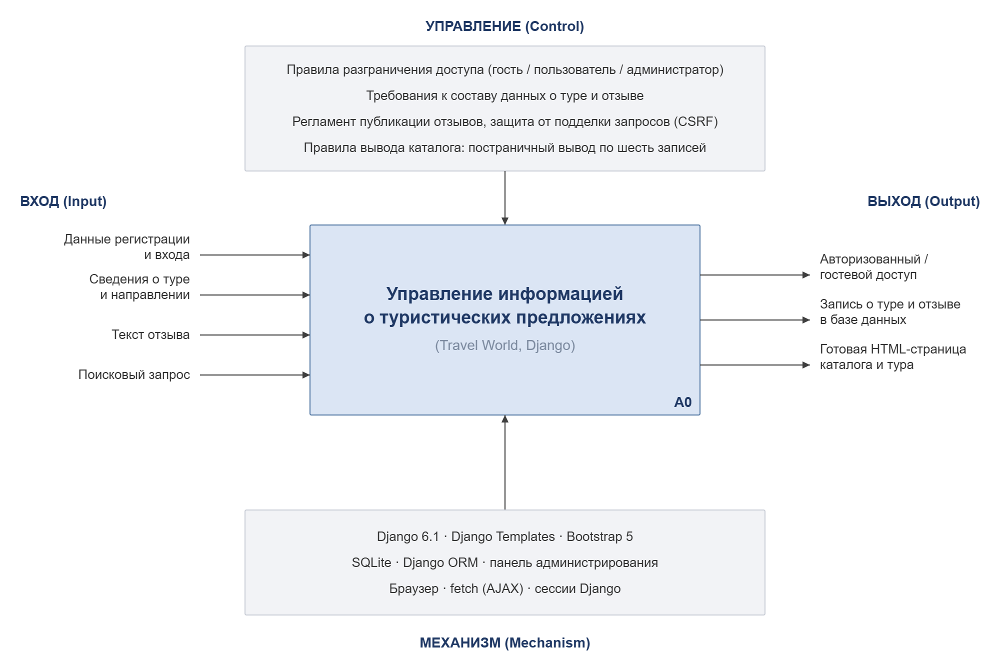
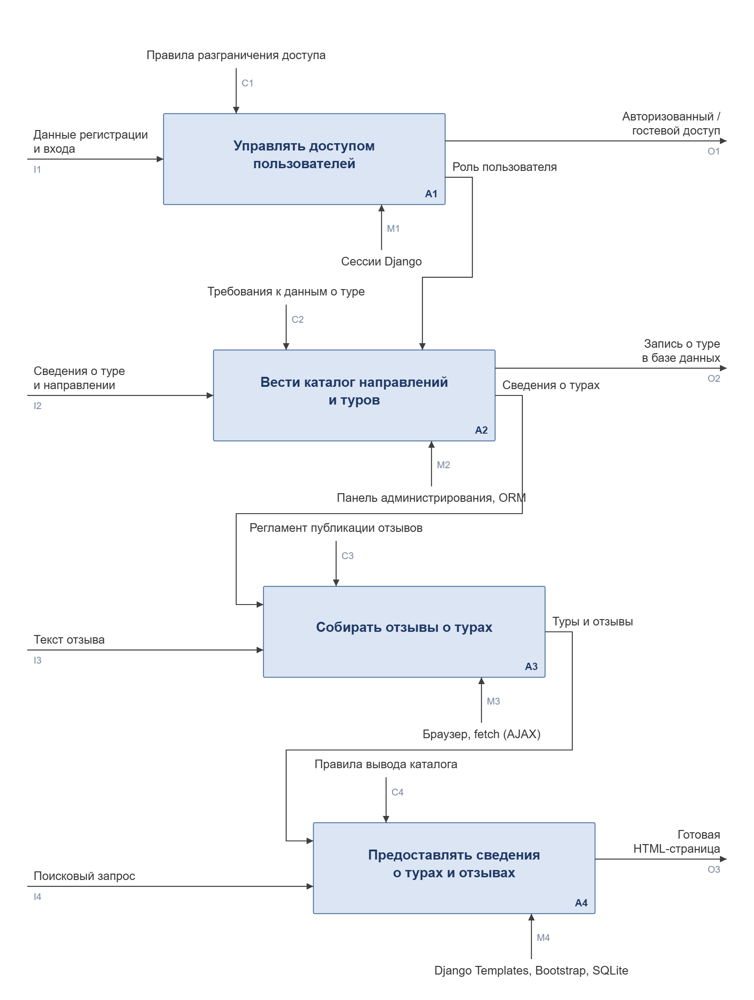

# IDEF0. Функциональная модель

Проект: веб-приложение «Бюро путешествий» (Travel World)
Траектория А: Django + Django Templates

---

## Контекстная диаграмма A-0

Система показана одним блоком. Слева входы, сверху управление,
справа выходы, снизу механизмы.

### Интерфейсные дуги

| Код | Тип | Дуга |
|---|---|---|
| I1 | Вход | Данные регистрации и входа |
| I2 | Вход | Сведения о туре и направлении |
| I3 | Вход | Текст отзыва |
| I4 | Вход | Поисковый запрос |
| C1 | Управление | Правила разграничения доступа: гость / пользователь / администратор |
| C2 | Управление | Требования к составу данных о туре и отзыве |
| C3 | Управление | Регламент публикации отзывов, защита от подделки запросов (CSRF) |
| C4 | Управление | Правила вывода каталога: постраничный вывод по шесть записей |
| O1 | Выход | Авторизованный / гостевой доступ |
| O2 | Выход | Запись о туре и отзыве в базе данных |
| O3 | Выход | Готовая HTML-страница каталога и тура |
| M1 | Механизм | Django 6.1, Django Templates, Bootstrap 5 |
| M2 | Механизм | SQLite, Django ORM, панель администрирования |
| M3 | Механизм | Браузер, fetch (AJAX), сессии Django |

---

## Декомпозиция A0

Основной блок разбит на четыре функции.

### Функциональные блоки

| Блок | Функция | Что происходит | Где в коде |
|---|---|---|---|
| A1 | Управлять доступом пользователей | Регистрация, вход, выход, определение роли | `users/models.py`, `users/forms.py`, `users/views.py` |
| A2 | Вести каталог направлений и туров | Создание, изменение и удаление направлений и туров | `tours/models.py`, `tours/forms.py`, `tours/admin.py` |
| A3 | Собирать отзывы о турах | Добавление отзыва без перезагрузки страницы | `tours/views.py`, функция `review_add_ajax` |
| A4 | Предоставлять сведения о турах и отзывах | Каталог, отбор по направлению, поиск, страница тура | `tours/views.py`, каталог `templates/` |

### Дуги между блоками

| Откуда | Куда | Тип | Дуга |
|---|---|---|---|
| A1 | A2 | Управление | Роль пользователя — публиковать и править туры может только автор или администратор |
| A2 | A3 | Вход | Сведения о турах — отзыв всегда относится к конкретному туру |
| A3 | A4 | Вход | Туры и отзывы — данные, которые выводятся посетителю |

### Механизмы по блокам

| Блок | Механизм |
|---|---|
| A1 | Сессии Django |
| A2 | Панель администрирования, Django ORM |
| A3 | Браузер, fetch (AJAX) |
| A4 | Django Templates, Bootstrap, SQLite |
