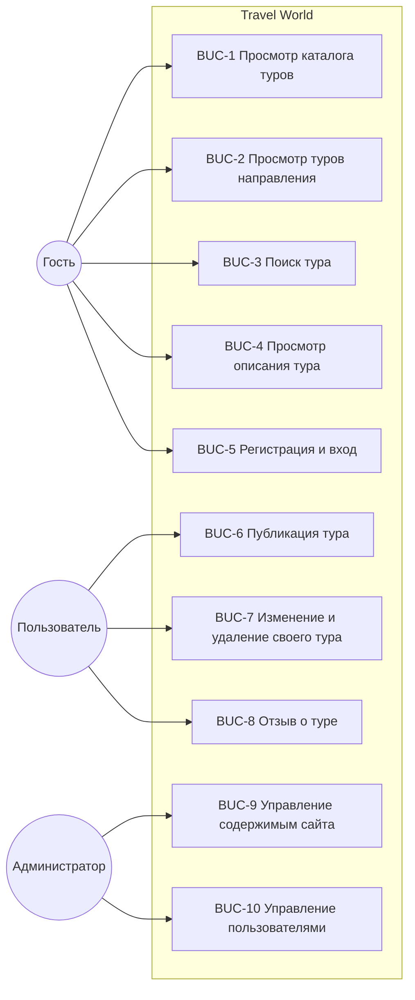

# BUC-диаграмма. Бизнес-прецеденты

Проект: веб-приложение «Бюро путешествий» (Travel World)

---

## Диаграмма

## Описание прецедентов

| Код | Прецедент | Кто выполняет | Результат |
|---|---|---|---|
| BUC-1 | Просмотр каталога туров | Гость, пользователь | Список туров по 6 на страницу |
| BUC-2 | Просмотр туров направления | Гость, пользователь | Туры выбранной страны |
| BUC-3 | Поиск тура | Гость, пользователь | Туры, подходящие под запрос |
| BUC-4 | Просмотр описания тура | Гость, пользователь | Полное описание, цена, отзывы |
| BUC-5 | Регистрация и вход | Гость | Открыта сессия, доступна закрытая часть |
| BUC-6 | Публикация тура | Пользователь | Новый тур в базе, автор — текущий пользователь |
| BUC-7 | Изменение и удаление своего тура | Пользователь | Обновлённые данные либо запись удалена |
| BUC-8 | Отзыв о туре | Пользователь | Отзыв виден на странице тура |
| BUC-9 | Управление содержимым сайта | Администратор | Правка любых туров, направлений, отзывов |
| BUC-10 | Управление пользователями | Администратор | Блокировка, выдача прав, правка профилей |

## Замечания

Пользователь наследует все возможности гостя, администратор — все
возможности пользователя. Прецеденты BUC-9 и BUC-10 выполняются
в админ-панели Django по адресу `/admin/`.

Изменять и удалять тур может только его автор либо администратор —
это проверяется в представлениях `tour_update` и `tour_delete`.
