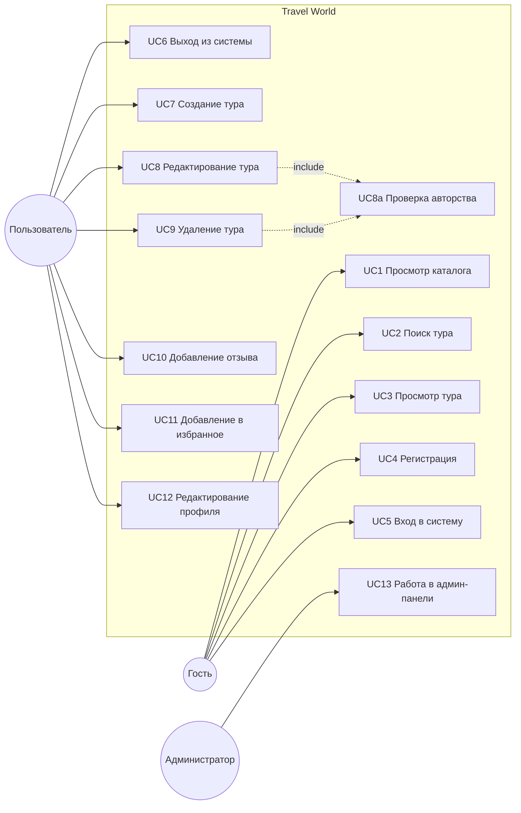

# Диаграмма вариантов использования (Use Case)

Проект: веб-приложение «Бюро путешествий» (Travel World)

---

## Диаграмма

## Сводка

| Код | Прецедент | Актор | Нужна авторизация |
|---|---|---|---|
| UC1 | Просмотр каталога | Гость, пользователь | нет |
| UC2 | Поиск тура | Гость, пользователь | нет |
| UC3 | Просмотр тура | Гость, пользователь | нет |
| UC4 | Регистрация | Гость | нет |
| UC5 | Вход в систему | Гость | нет |
| UC6 | Выход из системы | Пользователь | да |
| UC7 | Создание тура | Пользователь | да |
| UC8 | Редактирование тура | Пользователь | да, плюс авторство |
| UC9 | Удаление тура | Пользователь | да, плюс авторство |
| UC10 | Добавление отзыва | Пользователь | да |
| UC11 | Добавление в избранное | Пользователь | да |
| UC12 | Редактирование профиля | Пользователь | да |
| UC13 | Работа в админ-панели | Администратор | да, плюс `is_staff` |

---

## Спецификация UC5 «Вход в систему»

| Параметр | Значение |
|---|---|
| Актор | Гость |
| Цель | Получить доступ к закрытой части сайта |
| Предусловие | Пользователь зарегистрирован, сессия не открыта |
| Постусловие | Открыта сессия, идентификатор записан в cookie |
| Адрес | `/users/login/` |
| Модуль | `users/views.py`, функция `user_login` |

Основной сценарий:

1. Гость открывает страницу входа.
2. Система показывает форму с полями «Имя пользователя» и «Пароль».
3. Гость заполняет поля и нажимает «Войти».
4. Система проверяет csrf-токен.
5. Система сверяет логин и пароль с базой через `authenticate`.
6. Данные верные — вызывается `login`, открывается сессия.
7. Система перенаправляет на каталог и показывает сообщение «Вы вошли в систему».

Альтернативный сценарий А1 — неверные данные:

- 6а. `authenticate` вернул `None`.
- 6б. Система показывает сообщение «Неверный логин или пароль».
- 6в. Возврат к шагу 3, сессия не открывается.

---

## Спецификация UC7 «Создание тура»

| Параметр | Значение |
|---|---|
| Актор | Пользователь |
| Цель | Опубликовать новое туристическое предложение |
| Предусловие | Сессия открыта |
| Постусловие | В таблице `tours_tour` появилась запись, автор — текущий пользователь |
| Адрес | `/tour/new/` |
| Модуль | `tours/views.py`, функция `tour_create` |

Основной сценарий:

1. Пользователь открывает страницу добавления тура.
2. Декоратор `login_required` проверяет, что сессия открыта.
3. Система показывает форму: название, направление, описание, цена, дней, фото, признак публикации.
4. Пользователь заполняет форму и нажимает «Добавить».
5. Система проверяет csrf-токен и данные формы.
6. Система подставляет текущего пользователя в поле автора.
7. Запись сохраняется в базу.
8. Система перенаправляет на страницу нового тура и показывает «Тур добавлен».

Альтернативные сценарии:

- А1. Сессия не открыта — на шаге 2 переход на страницу входа с параметром `next`.
- А2. Цена меньше или равна нулю — форма возвращается с ошибкой «Цена должна быть больше нуля», запись не создаётся.
