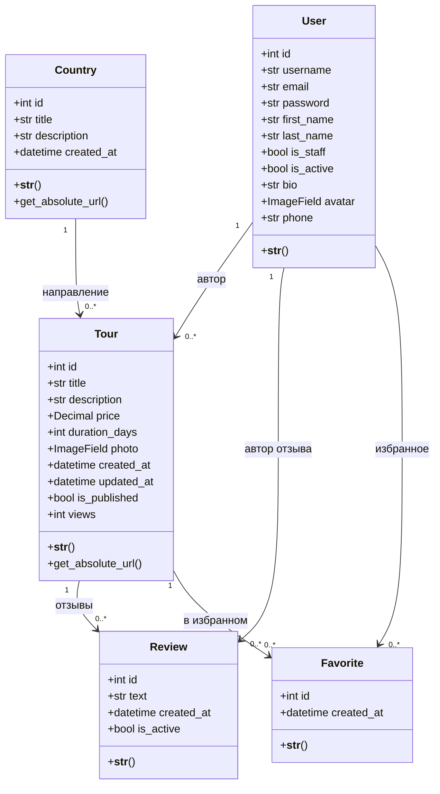

# Доменная модель. Диаграмма классов

Проект: веб-приложение «Бюро путешествий» (Travel World)

---

## Диаграмма

## Сущности

| Класс | Что описывает | Приложение |
|---|---|---|
| `User` | Пользователь сайта. Наследуется от `AbstractUser`, добавлены `bio`, `avatar`, `phone` | `users` |
| `Country` | Направление путешествия, играет роль категории | `tours` |
| `Tour` | Туристическое предложение — основная сущность | `tours` |
| `Review` | Отзыв пользователя о туре | `tours` |
| `Favorite` | Отметка «в избранном» для пары пользователь–тур | `tours` |

## Связи

| Связь | Тип | Поведение при удалении |
|---|---|---|
| `Country` → `Tour` | один ко многим | `PROTECT` — направление с турами удалить нельзя |
| `User` → `Tour` | один ко многим | `SET_NULL` — при удалении автора тур остаётся без автора |
| `Tour` → `Review` | один ко многим | `CASCADE` — вместе с туром удаляются его отзывы |
| `User` → `Review` | один ко многим | `CASCADE` |
| `User` → `Favorite` | один ко многим | `CASCADE` |
| `Tour` → `Favorite` | один ко многим | `CASCADE` |

## Бизнес-правила

1. Цена тура должна быть больше нуля — проверяется в `TourForm.clean_price`.
2. Отзыв не короче 10 символов — проверяется в `ReviewForm.clean_text`.
3. Один пользователь не может добавить один тур в избранное дважды — ограничение `unique_together` в модели `Favorite`.
4. Электронная почта уникальна для всех пользователей.
5. Редактировать и удалять тур может только его автор либо администратор.
6. В каталоге показываются только туры с признаком `is_published`. Автор видит и свои неопубликованные.
7. Каждое открытие страницы тура увеличивает счётчик `views` на единицу.
