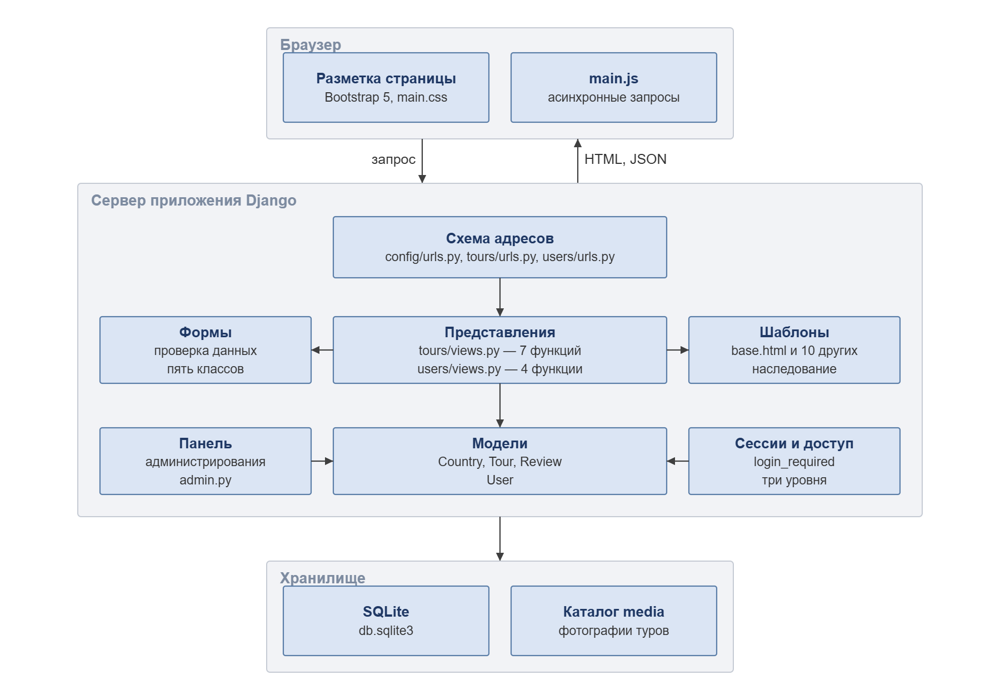
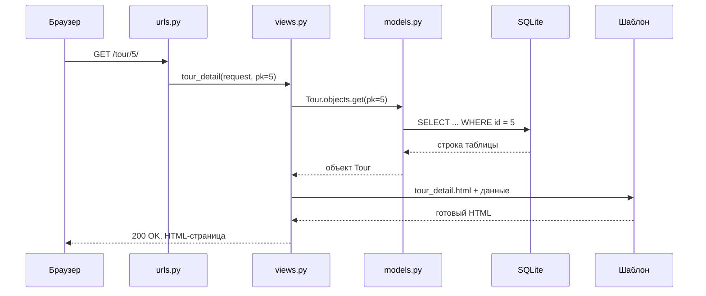
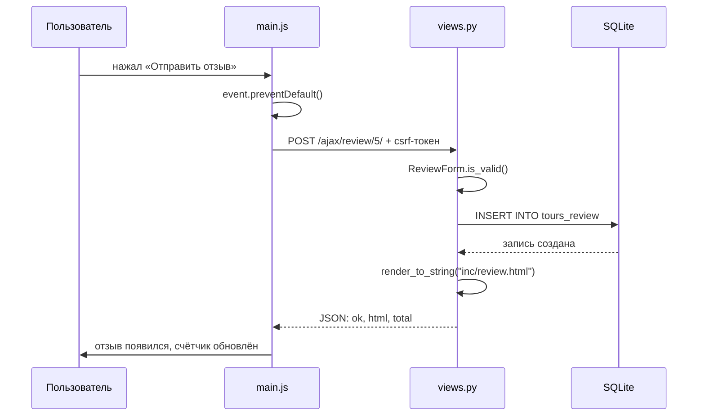

# Архитектура. Диаграмма компонентов

Проект: веб-приложение «Бюро путешествий» (Travel World)
Архитектурный стиль: Django MTV (Model — Template — View)

---

## Диаграмма компонентов

Приложение разделено на два модуля предметной области. Модуль `tours`
содержит модели направлений, туров и отзывов вместе с их представлениями
и шаблонами. Модуль `users` отвечает за учётные записи, аутентификацию
и разграничение доступа.

| Компонент | Файлы | Ответственность |
|---|---|---|
| Схема адресов | `config/urls.py`, `tours/urls.py`, `users/urls.py` | Сопоставление адреса запроса и функции-обработчика |
| Представления | `tours/views.py` — 7, `users/views.py` — 4 | Получение данных, проверка прав, выбор шаблона |
| Формы | `tours/forms.py`, `users/forms.py` | Проверка данных до записи в базу, пять классов |
| Шаблоны | `templates/` — 11 файлов | Разметка с наследованием от `base.html` |
| Модели | `tours/models.py`, `users/models.py` | Country, Tour, Review, User |
| Панель управления | `tours/admin.py`, `users/admin.py` | Управление содержимым и учётными записями |
| Сессии и доступ | встроенные механизмы Django | `login_required`, три уровня доступа |
| Хранилище | `db.sqlite3`, каталог `media/` | Данные и загруженные фотографии |

## Слои и ответственность

| Слой | Файлы | За что отвечает |
|---|---|---|
| Маршруты | `config/urls.py`, `tours/urls.py`, `users/urls.py` | Сопоставляет адрес и функцию-представление |
| View | `tours/views.py`, `users/views.py` | Достаёт данные, проверяет права, выбирает шаблон |
| Template | `templates/` | Формирует HTML, наследуется от `base.html` |
| Model | `tours/models.py`, `users/models.py` | Описывает таблицы, работает с базой через ORM |
| Формы | `tours/forms.py`, `users/forms.py` | Проверяет данные до записи в базу |
| Админ-панель | `admin.py` в обоих приложениях | Управление содержимым сайта |
| Аутентификация | Встроенные механизмы Django | Сессии, вход, выход, ограничение доступа |
| Статика | `static/` | Стили, скрипты, изображения |

---

## Схема взаимодействия клиент — сервер

Обычный переход по ссылке: браузер запрашивает страницу, сервер
собирает её целиком и отдаёт готовый HTML.

## Схема AJAX-запроса

Отправка отзыва: страница не перезагружается, сервер отвечает JSON,
скрипт сам дописывает блок отзыва.

## Обоснование выбора

Django выбран потому, что даёт из коробки то, что требуется по заданию:
ORM для работы с базой без ручного SQL, готовую систему пользователей
с шифрованием паролей и сессиями, автоматическую админ-панель и
шаблонизатор с наследованием. Стиль MTV разделяет данные, логику и
представление, поэтому каждый файл отвечает за одно.

База — SQLite: она входит в состав Python, не требует установки
и настройки сервера, чего достаточно для учебного проекта.
