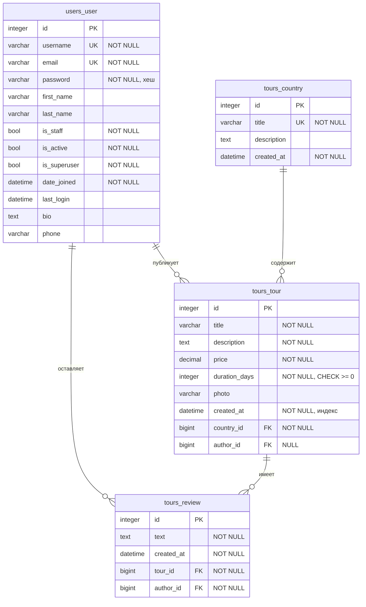

# ER-диаграмма и модель данных

Проект: веб-приложение «Бюро путешествий» (Travel World)
СУБД: SQLite, файл `backend/db.sqlite3`

---

## ER-диаграмма



## Связи

| Связь | Тип | Внешний ключ | При удалении |
|---|---|---|---|
| `tours_country` → `tours_tour` | 1 : N | `country_id` | `PROTECT` — направление с турами удалить нельзя |
| `users_user` → `tours_tour` | 1 : N | `author_id` | `SET NULL` — тур остаётся без автора |
| `tours_tour` → `tours_review` | 1 : N | `tour_id` | `CASCADE` — отзывы удаляются вместе с туром |
| `users_user` → `tours_review` | 1 : N | `author_id` | `CASCADE` |

## Индексы

| Индекс | Таблица | Поле | Зачем |
|---|---|---|---|
| `tours_tour_created_at` | `tours_tour` | `created_at` | Сортировка каталога по дате |
| `tours_tour_country_id` | `tours_tour` | `country_id` | Отбор туров по направлению |
| `tours_tour_author_id` | `tours_tour` | `author_id` | Проверка авторства при правке |
| `tours_review_tour_id` | `tours_review` | `tour_id` | Отзывы одного тура |
| `tours_review_author_id` | `tours_review` | `author_id` | Отзывы одного пользователя |

## Нормализация

| Форма | Как выполнена |
|---|---|
| 1НФ | Все поля хранят одно значение, повторяющихся групп в столбцах нет |
| 2НФ | Первичный ключ везде простой — `id`, поэтому частичных зависимостей быть не может |
| 3НФ | Неключевые поля не зависят друг от друга. Название направления лежит один раз в `tours_country`, тур ссылается на него через `country_id`, а не дублирует текстом |

---

## DDL-скрипты

Сняты из SQLite после применения миграций Django.

```sql
CREATE TABLE "users_user" (
    "id"           integer      NOT NULL PRIMARY KEY AUTOINCREMENT,
    "password"     varchar(128) NOT NULL,
    "last_login"   datetime     NULL,
    "is_superuser" bool         NOT NULL,
    "username"     varchar(150) NOT NULL UNIQUE,
    "first_name"   varchar(150) NOT NULL,
    "last_name"    varchar(150) NOT NULL,
    "is_staff"     bool         NOT NULL,
    "is_active"    bool         NOT NULL,
    "date_joined"  datetime     NOT NULL,
    "email"        varchar(254) NOT NULL UNIQUE,
    "bio"          text         NOT NULL,
    "phone"        varchar(20)  NOT NULL
);

CREATE TABLE "tours_country" (
    "id"          integer      NOT NULL PRIMARY KEY AUTOINCREMENT,
    "title"       varchar(150) NOT NULL UNIQUE,
    "description" text         NOT NULL,
    "created_at"  datetime     NOT NULL
);

CREATE TABLE "tours_tour" (
    "id"            integer          NOT NULL PRIMARY KEY AUTOINCREMENT,
    "title"         varchar(200)     NOT NULL,
    "description"   text             NOT NULL,
    "price"         decimal          NOT NULL,
    "duration_days" integer unsigned NOT NULL CHECK ("duration_days" >= 0),
    "photo"         varchar(100)     NULL,
    "created_at"    datetime         NOT NULL,
    "author_id"     bigint           NULL REFERENCES "users_user" ("id"),
    "country_id"    bigint           NOT NULL REFERENCES "tours_country" ("id")
);

CREATE TABLE "tours_review" (
    "id"         integer  NOT NULL PRIMARY KEY AUTOINCREMENT,
    "text"       text     NOT NULL,
    "created_at" datetime NOT NULL,
    "author_id"  bigint   NOT NULL REFERENCES "users_user" ("id"),
    "tour_id"    bigint   NOT NULL REFERENCES "tours_tour" ("id")
);

CREATE INDEX "tours_tour_created_at"  ON "tours_tour" ("created_at");
CREATE INDEX "tours_tour_country_id"  ON "tours_tour" ("country_id");
CREATE INDEX "tours_tour_author_id"   ON "tours_tour" ("author_id");
CREATE INDEX "tours_review_tour_id"   ON "tours_review" ("tour_id");
CREATE INDEX "tours_review_author_id" ON "tours_review" ("author_id");
```
