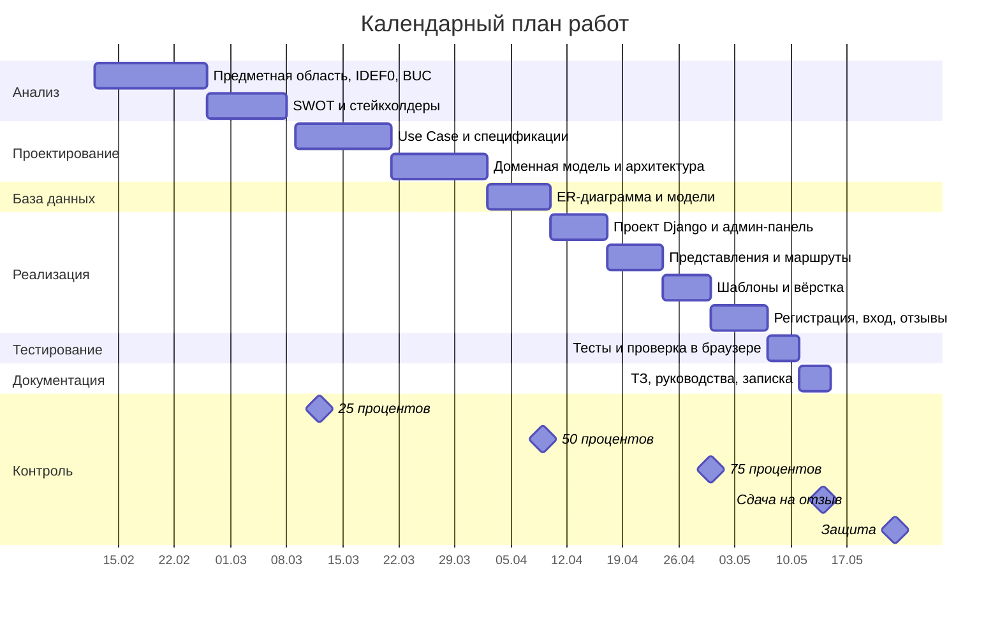

# Управление проектом: WBS, диаграмма Ганта, риски

Проект: веб-приложение «Бюро путешествий» (Travel World)

---

## WBS — иерархическая структура работ

```mermaid
flowchart TB
    P["Travel World"]

    P --> W1["1. Анализ"]
    P --> W2["2. Проектирование"]
    P --> W3["3. База данных"]
    P --> W4["4. Реализация"]
    P --> W5["5. Тестирование"]
    P --> W6["6. Документация"]

    W1 --> W11["1.1 Предметная область"]
    W1 --> W12["1.2 IDEF0 и BUC"]
    W1 --> W13["1.3 SWOT, стейкхолдеры"]

    W2 --> W21["2.1 Use Case и спецификации"]
    W2 --> W22["2.2 Доменная модель"]
    W2 --> W23["2.3 Архитектура MTV"]

    W3 --> W31["3.1 ER-диаграмма"]
    W3 --> W32["3.2 Модели и миграции"]
    W3 --> W33["3.3 Нормализация, индексы"]

    W4 --> W41["4.1 Проект Django, два приложения"]
    W4 --> W42["4.2 Админ-панель"]
    W4 --> W43["4.3 Представления и маршруты"]
    W4 --> W44["4.4 Шаблоны и вёрстка"]
    W4 --> W45["4.5 Регистрация и вход"]
    W4 --> W46["4.6 Отзывы через AJAX"]

    W5 --> W51["5.1 Тесты моделей и представлений"]
    W5 --> W52["5.2 Тесты доступа"]
    W5 --> W53["5.3 Проверка в браузере"]

    W6 --> W61["6.1 Техническое задание"]
    W6 --> W62["6.2 Руководства"]
    W6 --> W63["6.3 Пояснительная записка"]
    W6 --> W64["6.4 README и статистика"]
```

## Трудозатраты

| Этап | Работы | Часы |
|---|---|---|
| 1. Анализ | Предметная область, IDEF0, BUC, SWOT, стейкхолдеры | 8 |
| 2. Проектирование | Use Case, доменная модель, архитектура | 12 |
| 3. База данных | ER-диаграмма, модели, миграции, индексы | 8 |
| 4. Реализация | Проект, админка, представления, шаблоны, вход, отзывы | 28 |
| 5. Тестирование | Тесты и проверка в браузере | 8 |
| 6. Документация | ТЗ, руководства, записка, README | 16 |
| **Итого** | | **80** |

---

## Диаграмма Ганта

## Контрольные точки

| Готовность | Что сдаётся | Срок |
|---|---|---|
| 25 % | Аналитическая часть | 12 марта 2026 |
| 50 % | Проектная часть | 9 апреля 2026 |
| 75 % | Реализационная часть | 30 апреля 2026 |
| 100 % | Работа на отзыв | 14 мая 2026 |
| Защита | | 23 мая 2026 |

---

## Управление рисками

| № | Риск | Вероятность | Влияние | Что делаем |
|---|---|---|---|---|
| R1 | Не хватит времени на документацию | Средняя | Высокое | Диаграммы делаем сразу в `docs/`, а не в конце |
| R2 | Ошибка в миграциях, база не собирается | Средняя | Среднее | Команда `seed_demo` пересобирает данные с нуля |
| R3 | Спам в отзывах | Средняя | Низкое | Администратор удаляет лишние отзывы через админ-панель |
| R4 | Потеря файла базы `db.sqlite3` | Низкая | Высокое | База не в репозитории, данные восстанавливаются `seed_demo` |
| R5 | Загрузка постороннего файла через поле фото | Низкая | Среднее | `ImageField` проверяет, что файл — изображение |
| R6 | Bootstrap с внешнего CDN не загрузился | Низкая | Низкое | Свои стили в `static/css/main.css` работают независимо |
