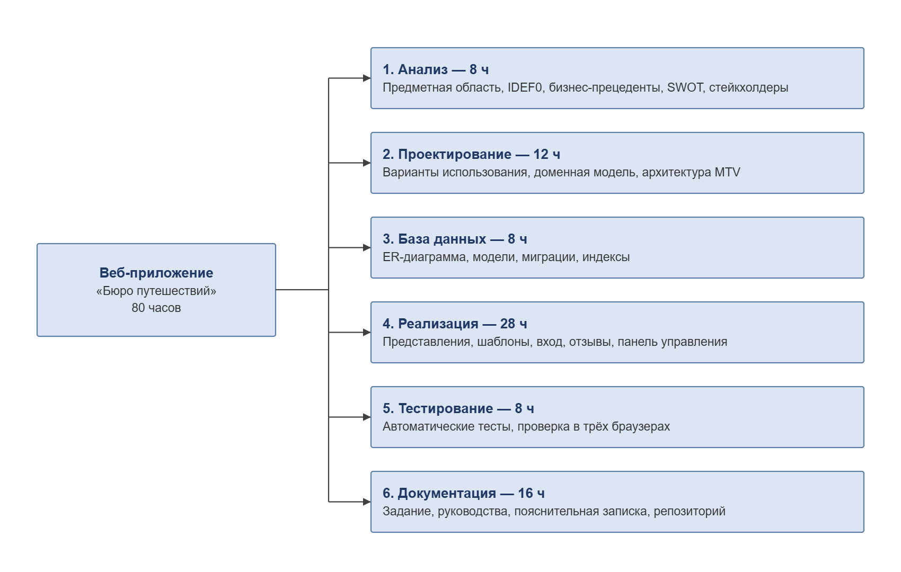
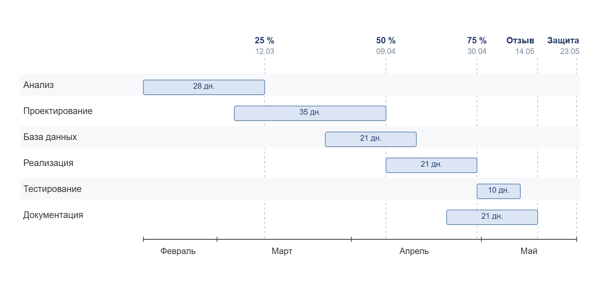

# Управление проектом: WBS, диаграмма Ганта, риски

Проект: веб-приложение «Бюро путешествий» (Travel World)

---

## WBS — иерархическая структура работ

| Группа работ | Состав | Часы |
|---|---|---|
| 1. Анализ | Предметная область, IDEF0, бизнес-прецеденты, SWOT, стейкхолдеры | 8 |
| 2. Проектирование | Варианты использования, доменная модель, архитектура MTV | 12 |
| 3. База данных | ER-диаграмма, модели, миграции, индексы | 8 |
| 4. Реализация | Представления, шаблоны, вход, отзывы, панель управления | 28 |
| 5. Тестирование | Автоматические тесты, проверка в трёх браузерах | 8 |
| 6. Документация | Задание, руководства, пояснительная записка, репозиторий | 16 |
| **Итого** | | **80** |

## Календарный план

| Веха | Дата | Что предоставляется |
|---|---|---|
| 25 % | 12.03.2026 | Аналитическая часть |
| 50 % | 09.04.2026 | Проектная часть |
| 75 % | 30.04.2026 | Реализационная часть |
| Отзыв | 14.05.2026 | Работа целиком |
| Защита | 23.05.2026 | Представление результатов |

## Управление рисками

| № | Риск | Вероятность | Влияние | Что делаем |
|---|---|---|---|---|
| R1 | Не хватит времени на документацию | Средняя | Высокое | Диаграммы делаем сразу в `docs/`, а не в конце |
| R2 | Ошибка в миграциях, база не собирается | Средняя | Среднее | Команда `seed_demo` пересобирает данные с нуля |
| R3 | Спам в отзывах | Средняя | Низкое | Администратор удаляет лишние отзывы через админ-панель |
| R4 | Потеря файла базы `db.sqlite3` | Низкая | Высокое | База не в репозитории, данные восстанавливаются `seed_demo` |
| R5 | Загрузка постороннего файла через поле фото | Низкая | Среднее | `ImageField` проверяет, что файл — изображение |
| R6 | Bootstrap с внешнего CDN не загрузился | Низкая | Низкое | Свои стили в `static/css/main.css` работают независимо |
