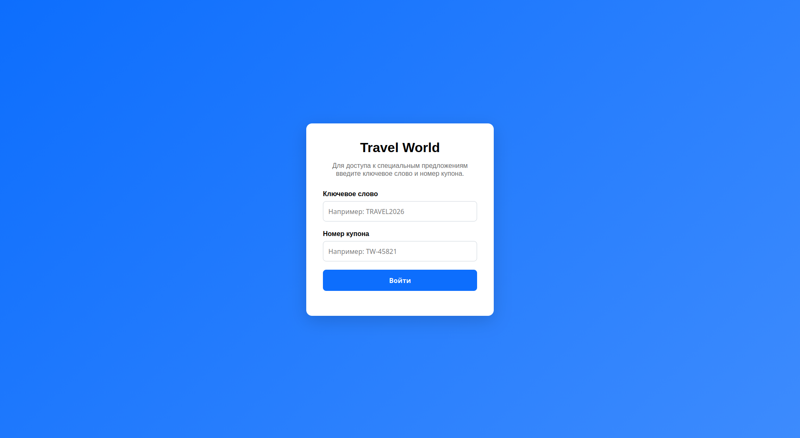
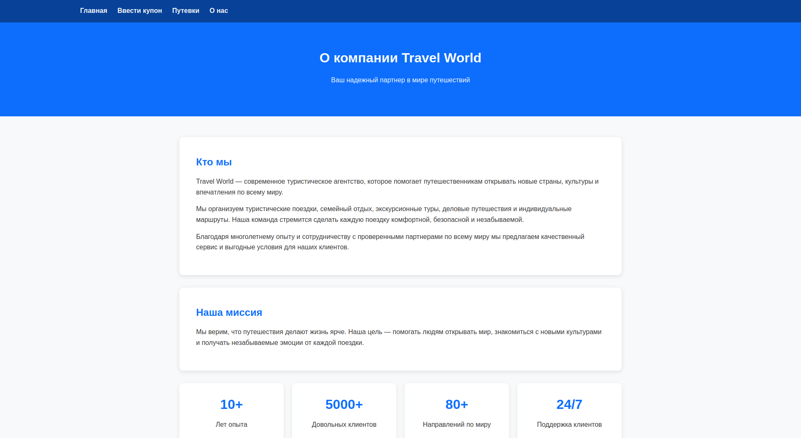
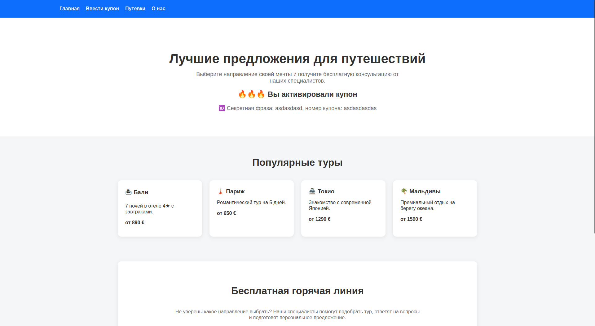

# 🌍 Travel World — SPA for Travel Experience (and Architecture Research)

**Travel World** — это учебное SPA-приложение о путешествиях по миру, созданное как демонстрация собственной frontend-архитектуры без использования фреймворков (React / Vue / Angular).

Изначальная идея проекта — туристическое агентство с турами, авторизацией и страницами направлений.  
Но реальная цель — исследование и построение собственной SPA-архитектуры на чистом JavaScript.






---

# ✈️ О проекте

Приложение имитирует сайт турагентства:

- 🏠 Главная страница с направлениями
- 🧭 Страница "О нас"
- 🎫 Страница туров и спецпредложений
- 🔐 Авторизация по ключевому слову и купону

После авторизации пользователь получает доступ к предложениям и может переходить между страницами без перезагрузки.

---

# 🧠 Архитектурная идея

Проект построен как эксперимент по созданию мини-фреймворка поверх браузерного API.

Вместо React/Vue используются собственные абстракции:

### 🔧 Ключевые концепции

- **Router** — управление навигацией через History API
- **Page system** — аналог компонентов с жизненным циклом
- **Mount / Unmount lifecycle** — управление подписками и очисткой
- **Custom navigation** — SPA переходы без перезагрузки страницы
- **CSS isolation strategy** — стили подключаются и удаляются динамически
- **LocalStorage auth** — простая клиентская авторизация без backend

---

# 🧩 Архитектура проекта

```

src/
├── pages/        # UI-страницы (components)
├── shared/
│   ├── utils/    # Router, Page system
│   ├── helpers/  # navigate, style manager
│   └── consts/   # events
├── assets/       # изображения и ресурсы

```

---

# 🔁 Навигация

Навигация реализована через кастомный router:

```js
navigate("/offers");
```

Или через события:

```js
window.dispatchEvent(
  new CustomEvent("routeChange", {
    detail: { pathname: "/offers" },
  }),
);
```

---

# 🔐 Авторизация

Авторизация реализована на клиенте через `localStorage`:

```js
{
  keyword: "TRAVEL2026",
  coupon: "TW-45821",
  authorizedAt: 1700000000000
}
```

После успешной авторизации пользователь перенаправляется на:

```
/offers
```

---

# 🎨 Изоляция стилей

Каждая страница использует собственный CSS-файл, который:

- подключается при монтировании страницы
- удаляется при размонтировании

Это предотвращает конфликты стилей между страницами без использования CSS-in-JS или Shadow DOM.

---

# ⚙️ Основные особенности

- SPA без фреймворков
- собственный router на History API
- lifecycle компонентов (mount/unmount)
- ручное управление событиями
- динамическое управление стилями
- простая клиентская авторизация

---

# 🧪 Цель проекта

Этот проект создан как:

> исследование того, как устроены современные frontend-фреймворки “изнутри”

Он показывает, как можно построить:

- SPA архитектуру
- систему компонентов
- роутинг
- управление состоянием
- и изоляцию UI

без использования внешних библиотек.

---

# 🚀 Возможные улучшения

- route guards (защита страниц)
- middleware роутера
- state manager (mini-store)
- layout system
- query params parser
- lazy loading страниц

---

# 📌 Стек

- Vanilla JavaScript (ES Modules)
- History API
- LocalStorage
- HTML/CSS

---

# 🧭 Итог

Это не просто сайт о путешествиях.

Это эксперимент:

> как построить свой мини-frontend framework, начиная с нуля, поверх браузера.

---

# 📊 Статистика разработки

## Метрики Git

| Метрика | Значение |
|---|---|
| Всего коммитов | 1 |
| Период | 10.06.2026 |
| Ветка | main |

## Структура документации

```
docs/
├── 01-idef0-diagrams/      # IDEF0 A-0 — контекстная диаграмма
├── 02-buc-diagrams/        # BUC-диаграмма бизнес-прецедентов
├── 03-swot-diagrams/       # SWOT-анализ
├── 04-stakeholders/        # Матрица стейкхолдеров, паспорт проекта
├── 05-usecase-diagrams/    # Use Case диаграмма
├── 06-domain-model/        # Доменная модель (классы)
├── 07-architecture/        # Архитектурная диаграмма компонентов
├── 08-er-diagrams/         # ER-диаграмма данных
├── 09-wbs-gantt/           # WBS и диаграмма Ганта
├── глоссарий.md            # Технический глоссарий
├── руководство-пользователя.md
└── тз-записка.md           # Техническое задание
ПОЯСНИТЕЛЬНАЯ_ЗАПИСКА.pdf   # Полный отчёт по проекту
```
