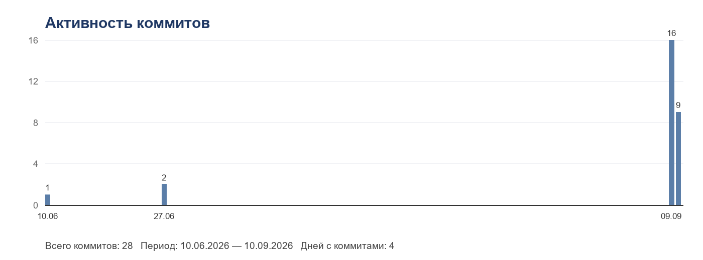
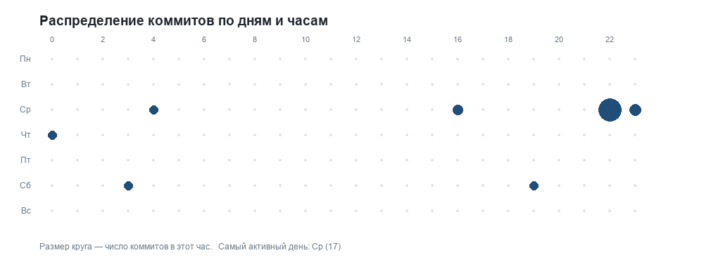

# Бюро путешествий (Travel World)

Веб-приложение туристического агентства на Django. Курсовой проект
по дисциплине «Технология разработки программного обеспечения»,
траектория А — full-stack Django.

Посетитель смотрит каталог туров по направлениям, читает описания
и отзывы. Зарегистрированный пользователь публикует свои туры,
оставляет отзывы и собирает избранное. Администратор управляет
содержимым через админ-панель Django.

## Возможности

**Без регистрации**

- каталог туров с постраничным выводом по 6 записей
- отбор по направлениям
- страница тура: описание, цена, длительность, фото, отзывы
- поиск по названию и описанию с подсказками по мере ввода
- счётчик просмотров

**После входа**

- создание, редактирование и удаление своих туров
- загрузка фотографии тура
- черновики: тур без признака «Опубликован» виден только автору
- отзывы без перезагрузки страницы
- избранное
- профиль с аватаром и личными данными

**Администратор**

- админ-панель: туры, направления, отзывы, пользователи
- скрытие отзыва без удаления записи
- выдача прав и блокировка учётных записей

## Стек

| Компонент | Что использовано |
|---|---|
| Язык | Python 3.14 |
| Каркас | Django 6.1 |
| Шаблоны | Django Templates |
| Оформление | Bootstrap 5, свои стили |
| База данных | SQLite |
| Изображения | Pillow |
| Динамика на клиенте | свой JavaScript, `fetch` |

## Установка

```bash
git clone https://github.com/Seihposwag/sofa-travel-app.git
cd sofa-travel-app
py -m venv .venv
.venv\Scripts\pip install -r backend\requirements.txt
```

Создать базу и наполнить её тестовыми данными:

```bash
cd backend
..\.venv\Scripts\python manage.py migrate
..\.venv\Scripts\python manage.py seed_demo
```

## Запуск

```bash
cd backend
..\.venv\Scripts\python manage.py runserver
```

Сайт — http://localhost:8000, админ-панель — http://localhost:8000/admin/

Тестовые аккаунты, пароль у всех `travel2026`:

| Логин | Роль |
|---|---|
| `admin` | администратор |
| `manager` | пользователь, автор туров |
| `traveller` | пользователь, автор отзывов |

## Тесты

```bash
cd backend
..\.venv\Scripts\python manage.py test
```

21 тест: модели и связи, каталог, пагинация, поиск, отбор по
направлению, счётчик просмотров, разграничение доступа к правке
и удалению, AJAX-обработчики, регистрация, вход, выход, профиль.

## Структура проекта

```
sofa-travel-app/
├── backend/
│   ├── manage.py
│   ├── requirements.txt
│   ├── config/               настройки и корневые адреса
│   ├── tours/                направления, туры, отзывы, избранное
│   └── users/                пользователи и доступ
├── templates/
│   ├── base.html             общий каркас страницы
│   ├── inc/                  карточка тура, отзыв, пагинация
│   ├── tours/                каталог, тур, формы, направления
│   └── users/                вход, регистрация, профиль
├── static/                   css, js, изображения
├── media/                    загруженные фото и аватары
└── docs/                     документация и диаграммы
```

## Адреса

| Адрес | Страница |
|---|---|
| `/` | каталог и поиск |
| `/countries/` | список направлений |
| `/country/<id>/` | туры направления |
| `/tour/<id>/` | страница тура |
| `/tour/new/` | добавление тура |
| `/my/` | свои туры |
| `/favorites/` | избранное |
| `/users/login/` | вход |
| `/users/register/` | регистрация |
| `/users/profile/` | профиль |
| `/admin/` | админ-панель |

## Документация

| Документ | Файл |
|---|---|
| Техническое задание | [docs/техническое-задание.md](docs/техническое-задание.md) |
| Руководство пользователя | [docs/руководство-пользователя.md](docs/руководство-пользователя.md) |
| Руководство администратора | [docs/руководство-администратора.md](docs/руководство-администратора.md) |
| Глоссарий | [docs/глоссарий.md](docs/глоссарий.md) |
| Пояснительная записка | [docs/Пояснительная_записка_Светлакова.docx](docs/) |

Диаграммы по этапам проектирования — GitHub рисует их прямо
в файлах:

| Этап | Диаграмма |
|---|---|
| 0 | [IDEF0 A-0 и декомпозиция](docs/01-idef0-diagrams/idef0-a0.md) |
| 0 | [BUC-диаграмма](docs/02-buc-diagrams/buc-diagram.md) |
| 0 | [SWOT-анализ](docs/03-swot-diagrams/swot-analysis.md) |
| 0 | [Стейкхолдеры и паспорт проекта](docs/04-stakeholders/stakeholders-matrix.md) |
| 1 | [Use Case и спецификации прецедентов](docs/05-usecase-diagrams/usecase-diagram.md) |
| 1 | [Доменная модель](docs/06-domain-model/domain-model.md) |
| 2 | [Архитектура и диаграммы последовательности](docs/07-architecture/architecture-diagram.md) |
| 3 | [ER-диаграмма, индексы, DDL](docs/08-er-diagrams/er-diagram.md) |
| — | [WBS, диаграмма Ганта, риски](docs/09-wbs-gantt/wbs-gantt.md) |

## Статистика разработки

### Метрики Git

| Метрика | Значение |
|---|---|
| Всего коммитов | 16 |
| Период | 10.06.2026 — 09.09.2026 |
| Ветка | main |
| Файлов под версионным контролем | 74 |
| Тестов | 21 |
| Строк кода на Python | 1079 без миграций |

### График активности коммитов



### Тепловая карта


